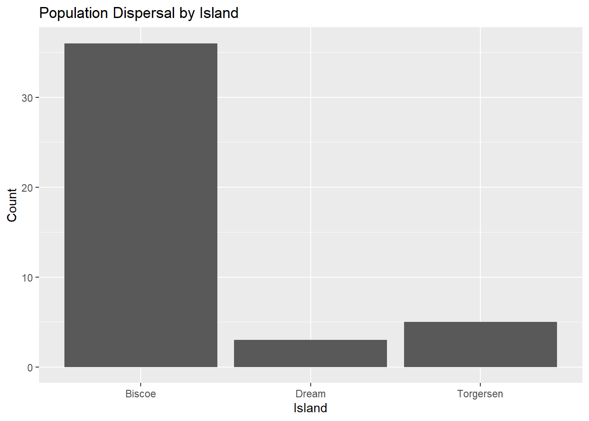
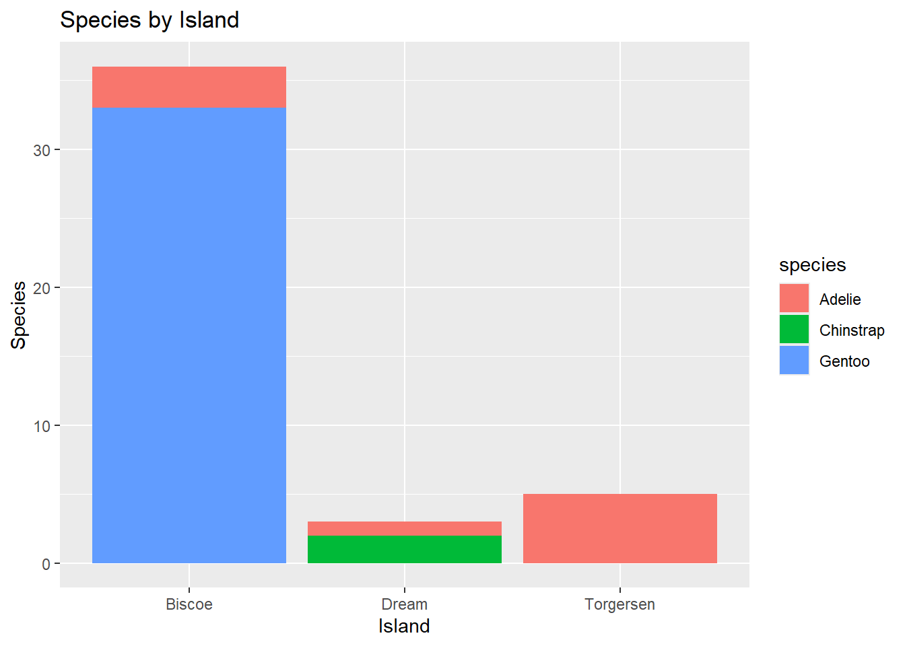

## Palmer Penguins

Analysis of Palmer Penguins Data


::: {.cell}

```{.r .cell-code}
#Load the tidyverse
library(tidyverse)
```

::: {.cell-output .cell-output-stderr}

```
── Attaching core tidyverse packages ──────────────────────── tidyverse 2.0.0 ──
✔ dplyr     1.1.4     ✔ readr     2.1.5
✔ forcats   1.0.0     ✔ stringr   1.5.1
✔ ggplot2   3.5.1     ✔ tibble    3.2.1
✔ lubridate 1.9.4     ✔ tidyr     1.3.1
✔ purrr     1.0.2     
── Conflicts ────────────────────────────────────────── tidyverse_conflicts() ──
✖ dplyr::filter() masks stats::filter()
✖ dplyr::lag()    masks stats::lag()
ℹ Use the conflicted package (<http://conflicted.r-lib.org/>) to force all conflicts to become errors
```


:::

```{.r .cell-code}
#Read the penguins_samp1 data file from github
penguins <- read_csv("https://raw.githubusercontent.com/mcduryea/Intro-to-Bioinformatics/main/data/penguins_samp1.csv")
```

::: {.cell-output .cell-output-stderr}

```
Rows: 44 Columns: 8
── Column specification ────────────────────────────────────────────────────────
Delimiter: ","
chr (3): species, island, sex
dbl (5): bill_length_mm, bill_depth_mm, flipper_length_mm, body_mass_g, year

ℹ Use `spec()` to retrieve the full column specification for this data.
ℹ Specify the column types or set `show_col_types = FALSE` to quiet this message.
```


:::

```{.r .cell-code}
#See the first six rows of the data we've read in to our notebook
penguins %>% head()
```

::: {.cell-output .cell-output-stdout}

```
# A tibble: 6 × 8
  species island bill_length_mm bill_depth_mm flipper_length_mm body_mass_g
  <chr>   <chr>           <dbl>         <dbl>             <dbl>       <dbl>
1 Gentoo  Biscoe           59.6          17                 230        6050
2 Gentoo  Biscoe           48.6          16                 230        5800
3 Gentoo  Biscoe           52.1          17                 230        5550
4 Gentoo  Biscoe           51.5          16.3               230        5500
5 Gentoo  Biscoe           55.1          16                 230        5850
6 Gentoo  Biscoe           49.8          15.9               229        5950
# ℹ 2 more variables: sex <chr>, year <dbl>
```


:::
:::


Data chart compiling bill length, flipper length, bill depth, and body mass measurements of six male Gentoo penguins living on the island of Biscoe.

# Data Manipulation

Understanding coding in R using a given data set to practice how to manipulate & summarize using R. Specifically learning to filter rows, subset columns, group data, and compute summary statistics.

-   Were there any significant outliers in the data set?

-   If there were outliers, how did they skew the rest of the data?


::: {.cell}

```{.r .cell-code}
penguins %>%
  count(island)
```

::: {.cell-output .cell-output-stdout}

```
# A tibble: 3 × 2
  island        n
  <chr>     <int>
1 Biscoe       36
2 Dream         3
3 Torgersen     5
```


:::
:::


A breakdown of penguin populations by island. There is a much larger set of data for penguins on the island of Biscoe compared to Dream and Torgersen.


::: {.cell}

```{.r .cell-code}
penguins %>%
  count(species)
```

::: {.cell-output .cell-output-stdout}

```
# A tibble: 3 × 2
  species       n
  <chr>     <int>
1 Adelie        9
2 Chinstrap     2
3 Gentoo       33
```


:::
:::


There are three species of penguins in this data set, with Gentoo being the most populous by a large margin compared to Adelie and Chinstrap.


::: {.cell}

```{.r .cell-code}
penguins %>%
  count(island, species)
```

::: {.cell-output .cell-output-stdout}

```
# A tibble: 5 × 3
  island    species       n
  <chr>     <chr>     <int>
1 Biscoe    Adelie        3
2 Biscoe    Gentoo       33
3 Dream     Adelie        1
4 Dream     Chinstrap     2
5 Torgersen Adelie        5
```


:::
:::


Generated a table displaying data on the number of penguins of each species and which island they were found on.


::: {.cell}

```{.r .cell-code}
penguins %>%
  count (island, species) %>%
  pivot_wider(names_from = species, values_from = n, values_fill = 0)
```

::: {.cell-output .cell-output-stdout}

```
# A tibble: 3 × 4
  island    Adelie Gentoo Chinstrap
  <chr>      <int>  <int>     <int>
1 Biscoe         3     33         0
2 Dream          1      0         2
3 Torgersen      5      0         0
```


:::
:::


Simplified the data presentation in order to make it more readable, assigned a value of zero in the table for categories for which no data was gathered, for instance, no Gentoo penguins on the island of Torgersen


::: {.cell}

```{.r .cell-code}
library(kableExtra)
```

::: {.cell-output .cell-output-stderr}

```

Attaching package: 'kableExtra'
```


:::

::: {.cell-output .cell-output-stderr}

```
The following object is masked from 'package:dplyr':

    group_rows
```


:::

```{.r .cell-code}
penguins %>%
  count(island, species) %>%
  pivot_wider(names_from = species, values_from = n, values_fill = 0) %>%
  kable() %>%
  kable_styling(bootstrap_options = c("hover", "striped"))
```

::: {.cell-output-display}

`````{=html}
<table class="table table-hover table-striped" style="margin-left: auto; margin-right: auto;">
 <thead>
  <tr>
   <th style="text-align:left;"> island </th>
   <th style="text-align:right;"> Adelie </th>
   <th style="text-align:right;"> Gentoo </th>
   <th style="text-align:right;"> Chinstrap </th>
  </tr>
 </thead>
<tbody>
  <tr>
   <td style="text-align:left;"> Biscoe </td>
   <td style="text-align:right;"> 3 </td>
   <td style="text-align:right;"> 33 </td>
   <td style="text-align:right;"> 0 </td>
  </tr>
  <tr>
   <td style="text-align:left;"> Dream </td>
   <td style="text-align:right;"> 1 </td>
   <td style="text-align:right;"> 0 </td>
   <td style="text-align:right;"> 2 </td>
  </tr>
  <tr>
   <td style="text-align:left;"> Torgersen </td>
   <td style="text-align:right;"> 5 </td>
   <td style="text-align:right;"> 0 </td>
   <td style="text-align:right;"> 0 </td>
  </tr>
</tbody>
</table>

`````

:::
:::


Applied cosmetic styling to make the data set more readable.


::: {.cell}

```{.r .cell-code}
penguins %>%
  summarize(mean_bill_length_mm = mean (bill_length_mm))
```

::: {.cell-output .cell-output-stdout}

```
# A tibble: 1 × 1
  mean_bill_length_mm
                <dbl>
1                46.4
```


:::
:::


Computed the mean value but some data is missing modify code and resend


::: {.cell}

```{.r .cell-code}
penguins %>%
  summarize(mean_bill_length_mm = mean(bill_length_mm, na.rm = TRUE))
```

::: {.cell-output .cell-output-stdout}

```
# A tibble: 1 × 1
  mean_bill_length_mm
                <dbl>
1                46.4
```


:::
:::


Mean properly presented, making absent data as NA so it does not affect further calculations/data manipulations.


::: {.cell}

```{.r .cell-code}
penguins %>%
  summarize(
    min_bill_length = min(bill_length_mm, na.rm = TRUE),
    first_quartile_bill_length = quantile(bill_length_mm, 0.25, na.rm = TRUE),
    median_bill_length_mm = mean(bill_length_mm, na.rm = TRUE),
    third_quartile_bill_length = quantile(bill_length_mm, 0.75, na.rm = TRUE),
    standard_deviation_bill_length = sd(bill_length_mm, na.rm = TRUE)
  ) %>%
  pivot_longer(cols = everything())
```

::: {.cell-output .cell-output-stdout}

```
# A tibble: 5 × 2
  name                           value
  <chr>                          <dbl>
1 min_bill_length                36.2 
2 first_quartile_bill_length     44.6 
3 median_bill_length_mm          46.4 
4 third_quartile_bill_length     49.1 
5 standard_deviation_bill_length  4.93
```


:::
:::


Long table presenting the table of calculated data


::: {.cell}

```{.r .cell-code}
penguins %>%
  summarize(
    min_bill_length = min(bill_length_mm, na.rm = TRUE),
    first_quartile_bill_length = quantile(bill_length_mm, 0.25, na.rm = TRUE),
    median_bill_length = median(bill_length_mm, na.rm = TRUE),
    mean_bill_length_mm = mean(bill_length_mm, na.rm = TRUE),
    third_quartile_bill_length = quantile(bill_length_mm, 0.75, na.rm = TRUE),
    standard_deviation_bill_length = sd(bill_length_mm, na.rm = TRUE)
    )
```

::: {.cell-output .cell-output-stdout}

```
# A tibble: 1 × 6
  min_bill_length first_quartile_bill_l…¹ median_bill_length mean_bill_length_mm
            <dbl>                   <dbl>              <dbl>               <dbl>
1            36.2                    44.6               46.4                46.4
# ℹ abbreviated name: ¹​first_quartile_bill_length
# ℹ 2 more variables: third_quartile_bill_length <dbl>,
#   standard_deviation_bill_length <dbl>
```


:::
:::


Very wide table, harder to digest, and not as aesthetically pleasing.


::: {.cell}

```{.r .cell-code}
penguins %>%
  summarize(
    min_bill_length = min(bill_length_mm, na.rm = TRUE),
    first_quartile_bill_length = quantile(bill_length_mm, 0.25, na.rm = TRUE),
    median_bill_length = median(bill_length_mm, na.rm = TRUE),
    mean_bill_length_mm = mean(bill_length_mm, na.rm = TRUE),
    third_quartile_bill_length = quantile(bill_length_mm, 0.75, na.rm = TRUE),
    standard_deviation_bill_length = sd(bill_length_mm, na.rm = TRUE)
    ) %>%
  pivot_longer(cols = everything()) %>%
kable() %>%
  kable_styling(bootstrap_options = c("hover", "striped"))
```

::: {.cell-output-display}

`````{=html}
<table class="table table-hover table-striped" style="margin-left: auto; margin-right: auto;">
 <thead>
  <tr>
   <th style="text-align:left;"> name </th>
   <th style="text-align:right;"> value </th>
  </tr>
 </thead>
<tbody>
  <tr>
   <td style="text-align:left;"> min_bill_length </td>
   <td style="text-align:right;"> 36.200000 </td>
  </tr>
  <tr>
   <td style="text-align:left;"> first_quartile_bill_length </td>
   <td style="text-align:right;"> 44.550000 </td>
  </tr>
  <tr>
   <td style="text-align:left;"> median_bill_length </td>
   <td style="text-align:right;"> 46.450000 </td>
  </tr>
  <tr>
   <td style="text-align:left;"> mean_bill_length_mm </td>
   <td style="text-align:right;"> 46.370455 </td>
  </tr>
  <tr>
   <td style="text-align:left;"> third_quartile_bill_length </td>
   <td style="text-align:right;"> 49.125000 </td>
  </tr>
  <tr>
   <td style="text-align:left;"> standard_deviation_bill_length </td>
   <td style="text-align:right;"> 4.930379 </td>
  </tr>
</tbody>
</table>

`````

:::
:::


Added striped pattern and column titles.


::: {.cell}

```{.r .cell-code}
penguins %>%
  select(species, island, sex, year)
```

::: {.cell-output .cell-output-stdout}

```
# A tibble: 44 × 4
   species island sex    year
   <chr>   <chr>  <chr> <dbl>
 1 Gentoo  Biscoe male   2007
 2 Gentoo  Biscoe male   2008
 3 Gentoo  Biscoe male   2009
 4 Gentoo  Biscoe male   2009
 5 Gentoo  Biscoe male   2009
 6 Gentoo  Biscoe male   2009
 7 Gentoo  Biscoe male   2008
 8 Gentoo  Biscoe male   2009
 9 Gentoo  Biscoe male   2008
10 Gentoo  Biscoe male   2007
# ℹ 34 more rows
```


:::
:::


Selected only data for species island sex and year.


::: {.cell}

```{.r .cell-code}
penguins %>%
  select(species, island, sex, year) %>%
  filter(species == "Chinstrap")
```

::: {.cell-output .cell-output-stdout}

```
# A tibble: 2 × 4
  species   island sex     year
  <chr>     <chr>  <chr>  <dbl>
1 Chinstrap Dream  male    2009
2 Chinstrap Dream  female  2007
```


:::
:::


Filtered data set by species displaying only data for Chinstrap penguins.


::: {.cell}

```{.r .cell-code}
chinstraps <- penguins %>%
  select(species, island, sex, year) %>%
  filter(species == "Chinstrap") %>%
  select(-species)

chinstraps %>%
  head()
```

::: {.cell-output .cell-output-stdout}

```
# A tibble: 2 × 3
  island sex     year
  <chr>  <chr>  <dbl>
1 Dream  male    2009
2 Dream  female  2007
```


:::
:::


Filtered out species. Now, displaying only island, sex, and year.


::: {.cell}

```{.r .cell-code}
penguins %>%
  group_by(species) %>%
  summarise(
    mean_bill_depth_mm = mean(bill_depth_mm, na.rm = TRUE),
    sd_bill_depth_mm = sd(bill_depth_mm, na.rm = TRUE)
  )
```

::: {.cell-output .cell-output-stdout}

```
# A tibble: 3 × 3
  species   mean_bill_depth_mm sd_bill_depth_mm
  <chr>                  <dbl>            <dbl>
1 Adelie                  17.8            0.935
2 Chinstrap               18.8            1.41 
3 Gentoo                  15.2            0.951
```


:::
:::


Calculates the mean and standard deviations of the bill depths for the penguins organized by species. Chinstrap penguins have significantly greater bill depths when compared to the other species of penguins.


::: {.cell}

```{.r .cell-code}
penguins %>%
  ggplot() +
  geom_bar(mapping = aes(x = species)) +
  labs(tile ="Counts of Penguin Species",
       x = "Species", y = "Count")
```

::: {.cell-output-display}
{width=672}
:::
:::


Basic black and white bar graph of the population of penguins organized by breed. There is a much larger population of Gentoo penguins compared to the other species. Plus signs (+) allow me to add the next line of code to the last effectively creating a chain of commands.


::: {.cell}

```{.r .cell-code}
penguins %>%
  ggplot() +
  geom_bar(mapping = aes(x = island)) +
  labs(title ="Population Dispersal by Island", x= "Island", y = "Count")
```

::: {.cell-output-display}
{width=672}
:::
:::


Using the same code logic, I was able to create a bar graph that shows the population of the penguins by island. This really puts into perspective how penguin populous Biscoe is in comparison to the other two islands.


::: {.cell}

```{.r .cell-code}
penguins %>%
  ggplot() +
  geom_histogram(mapping = aes(x = bill_length_mm),
                 color = "white",
                 fill = "blue") +
  labs(title ="Distribution of Bill Lengths",
       x = "Bill Length (mm)", y = "Count")
```

::: {.cell-output .cell-output-stderr}

```
`stat_bin()` using `bins = 30`. Pick better value with `binwidth`.
```


:::

::: {.cell-output-display}
{width=672}
:::
:::


The graph shows there are a wide range of Bill Lengths with a large majority of the penguins having bill lengths between 45 and 50mm. This is a pretty normal distribution.\


::: {.cell}

```{.r .cell-code}
penguins %>%
  ggplot() +
  geom_point(mapping = aes(x = bill_depth_mm, y = bill_length_mm)) +
  labs(title = "Bill Depth and Length",
       x = "Bill Depth (mm)",
       y = "Bill Length (mm)")
```

::: {.cell-output-display}
{width=672}
:::
:::


\
This plot shows us the bill depth is much more widely varied compared to the more bell curve standard shape of the bill length. The bill depth has a lot more data skewed lower.


::: {.cell}

```{.r .cell-code}
penguins %>%
  ggplot() +
  geom_point(mapping = aes(x = sex, y = bill_length_mm)) +
  labs(title = "Bill Length and Sex",
       x = "Sex",
       y = "Bill Length (mm)")
```

::: {.cell-output-display}
{width=672}
:::
:::


This chart shows that male penguins tend to have longer bills than females. In addition, the bill length is more varied among males. Although this may not be the best graph format for this type of data analysis, a better format may be a scatterplot showing bill length along with depth, with points color-coded to differentiate different sexes of the penguins.


::: {.cell}

```{.r .cell-code}
penguins %>%
  ggplot() +
  geom_bar(mapping = aes(x = island, fill = species)) +
  labs(title = "Species by Island",
       x = "Island",
       y = "Species")
```

::: {.cell-output-display}
{width=672}
:::
:::


Breakdown of island species makeup. Gentoo is by far the most populous species, however Adelie are the most widespread among the data set.


::: {.cell}

```{.r .cell-code}
penguins %>%
  ggplot() +
  geom_boxplot(mapping = aes(x = bill_depth_mm, y = species)) +
  labs(title = "Bill Depth by Species",
       x = "Bill Depth (mm)",
       y = "")
```

::: {.cell-output-display}
{width=672}
:::
:::


This type of chart is rather informative once it is deciphered. However, for someone who does not see this style of graph often, it can be a bit hard to understand how to interpret the data.


::: {.cell}

```{.r .cell-code}
penguins %>%
  ggplot() +
  geom_histogram(mapping = aes(x = bill_depth_mm)) +
  facet_wrap(~species, ncol = 1) +
  labs(title = "Bill Depth by Species",
       x = "Bill Depth (mm)",
       y = "")
```

::: {.cell-output .cell-output-stderr}

```
`stat_bin()` using `bins = 30`. Pick better value with `binwidth`.
```


:::

::: {.cell-output-display}
{width=672}
:::
:::


The graph shows bill depth broken down by speciesand reflects the frequency of the data points. A y-axis label, such as "Number of Occurrences," would improve this graph.


::: {.cell}

```{.r .cell-code}
penguins %>%
  filter(!is.na(sex)) %>%
  ggplot() +
  geom_point(mapping = aes(x = bill_length_mm, 
                           y = flipper_length_mm,
                           color = species,
                           shape = sex)) +
  geom_smooth(mapping = aes(x = bill_length_mm,
                            y = flipper_length_mm,
                            color = species),
              method = "lm") +
  facet_grid(island ~ sex, scales = "free") +
  labs(title = "Flipper and Bill Lengths by Species and Sex",
       x = "Bill Length (mm)",
       y = "Flipper Length(mm)") +
  theme_light()
```

::: {.cell-output .cell-output-stderr}

```
`geom_smooth()` using formula = 'y ~ x'
```


:::

::: {.cell-output .cell-output-stderr}

```
Warning in qt((1 - level)/2, df): NaNs produced
Warning in qt((1 - level)/2, df): NaNs produced
```


:::

::: {.cell-output .cell-output-stderr}

```
Warning in max(ids, na.rm = TRUE): no non-missing arguments to max; returning
-Inf
Warning in max(ids, na.rm = TRUE): no non-missing arguments to max; returning
-Inf
```


:::

::: {.cell-output-display}
{width=672}
:::
:::


This data plot is by far the most informationally dense. The data shown here encompasses many of the recorded aspects. This data plot reminds me how important it is to know your audience when creating data graphics like this. For example, this chart is great for more advanced audiences, such as the scientifically inclined, but for more general audiences, it is more likely to be too complex. This graph shows that the bill length of Adelie penguins tends to be less than 45mm, whereas the average bill length of Gentoo penguins tends to be more than 45mm. The data set for Chinstrap penguins is too small to make clear, confident conjectures about the species as a whole.

The fascet_grid() function appears to add additional chart groupings in this case breaking down by island and sex.

```         
geom_point(mapping = aes(x = bill_length_mm,  +                            y = flipper_length_mm, +                            color = species, +                            shape = sex)) +
```

This function appears to identify the x and y axes as well as assign the species differences distinguishable by color, and the sexes are distinguishable by shape. The shape distinguishing sex seems a little bit redundant given the sex callouts and breakdowns at top of the graphs.


::: {.cell}

```{.r .cell-code}
penguins %>%
  filter(!is.na(sex)) %>%
  ggplot() +
  geom_point(mapping = aes(x = bill_length_mm, 
                           y = bill_depth_mm,
                           color = species,
                           shape = sex)) +
  geom_smooth(mapping = aes(x = bill_length_mm,
                            y = bill_depth_mm,
                            color = species),
              method = "lm") +
  facet_grid(island ~ sex, scales = "free") +
  labs(title = "Bill Lengths and Depths by Species and Sex",
       x = "Bill Length (mm)",
       y = "Bill Depth (mm)") +
  theme_light()
```

::: {.cell-output .cell-output-stderr}

```
`geom_smooth()` using formula = 'y ~ x'
```


:::

::: {.cell-output .cell-output-stderr}

```
Warning in qt((1 - level)/2, df): NaNs produced
Warning in qt((1 - level)/2, df): NaNs produced
```


:::

::: {.cell-output .cell-output-stderr}

```
Warning in max(ids, na.rm = TRUE): no non-missing arguments to max; returning
-Inf
Warning in max(ids, na.rm = TRUE): no non-missing arguments to max; returning
-Inf
```


:::

::: {.cell-output-display}
{width=672}
:::
:::


I swapped out flipper length for bill depth, as focusing on bills overall seemed to make more sense conceptually. Interestingly, I discovered that changing the last line of the code to theme_dark() transforms the chart to have a dark background. This makes the chart substantially less legible, and a deeper understanding of how to modify the chart colors would be needed in order to appreciate and use this function.


::: {.cell}

```{.r .cell-code}
penguins %>%
  ggplot() +
  geom_histogram(mapping = aes(x = bill_length_mm)) +
  facet_wrap(~species, ncol = 1) +
  labs(title = "Bill Length by Species",
       x = "Bill Length (mm)",
       y = "")
```

::: {.cell-output .cell-output-stderr}

```
`stat_bin()` using `bins = 30`. Pick better value with `binwidth`.
```


:::

::: {.cell-output-display}
{width=672}
:::
:::


Based on this data graphic, I feel confident in saying that Gentoo penguins tend to have bill lengths of 45mm or greater, whereas Adelie penguins tend to have bill lengths less than 45mm. However, I do not feel that there is enough data on Chinstrap penguinsto make a claim about their average bill length.


::: {.cell}

```{.r .cell-code}
penguins %>%
  ggplot() +
  geom_point(mapping = aes(x = bill_depth_mm, y = bill_length_mm)) +
  labs(title = "Bill Depth and Length",
       x = "Bill Depth (mm)",
       y = "Bill Length (mm)")
```

::: {.cell-output-display}
{width=672}
:::
:::


I asked at the beginning of the project whether there were any significant outliers in the data set. When it comes to bill length and depth, there do appear to be so. In this graphic, it is clear that there are two penguins I would consider outliers, the data point for the penguin with a bill length of close to 60mm and the other being the penguin with a bill depth of near 20mm.
